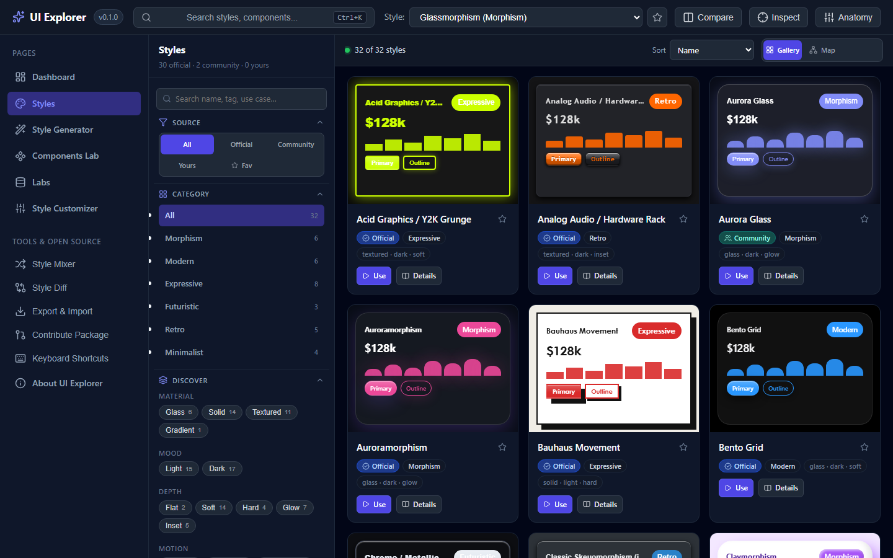
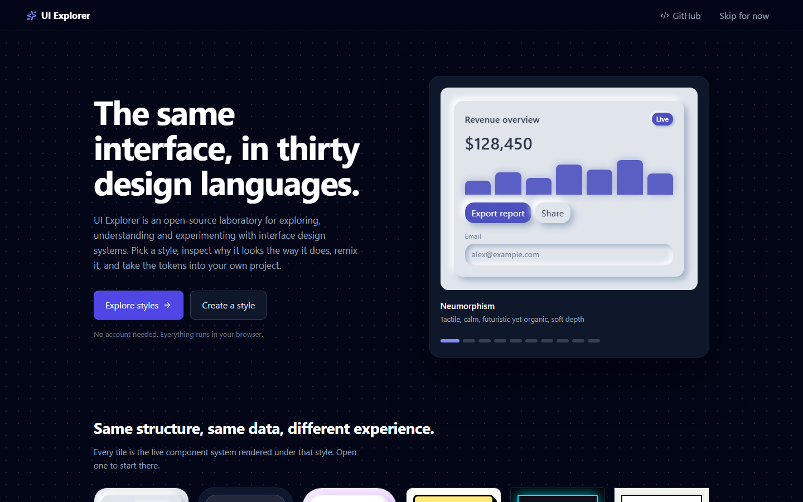
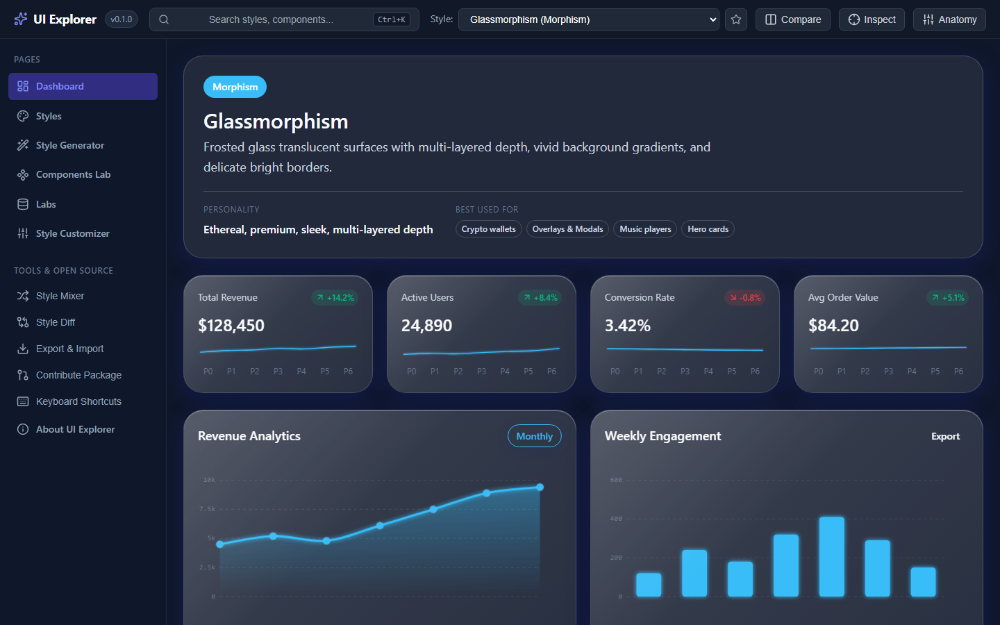
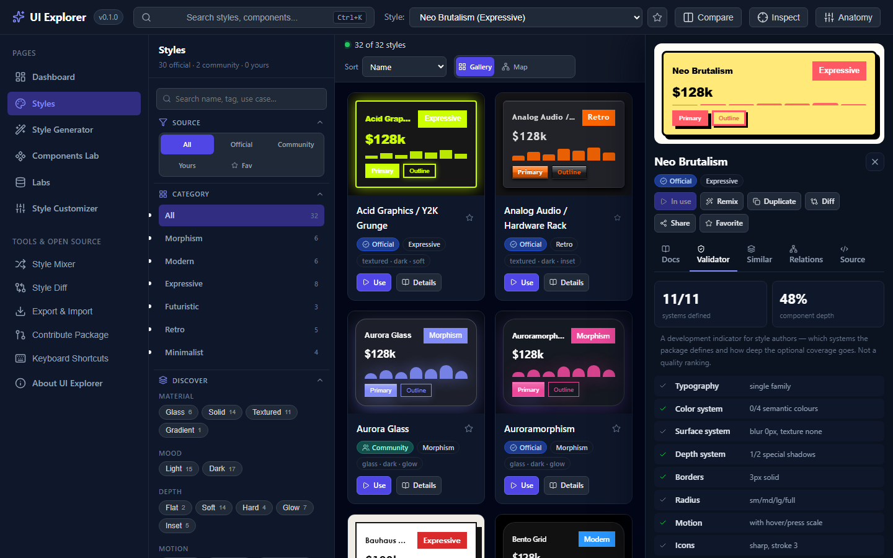
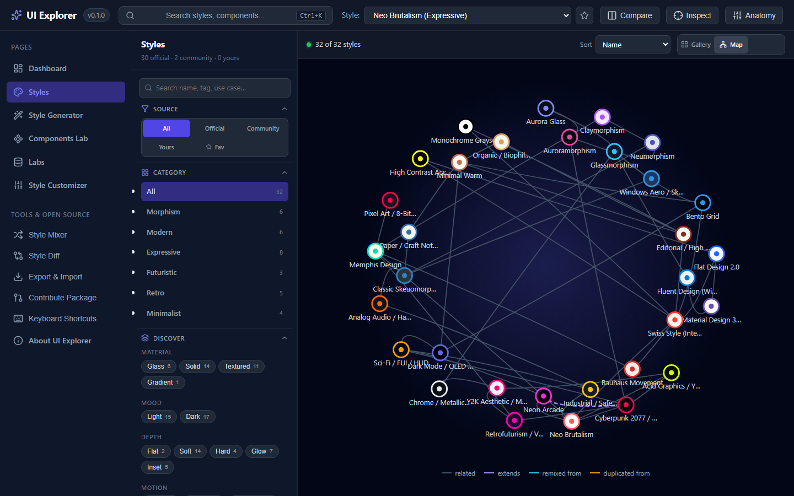
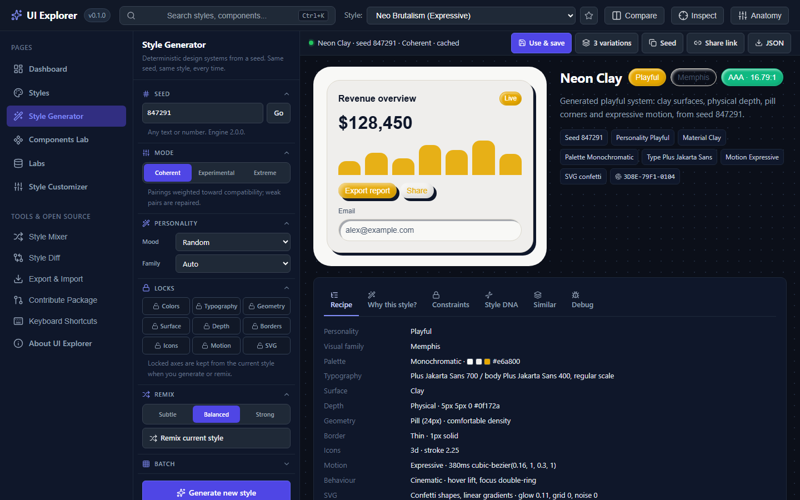
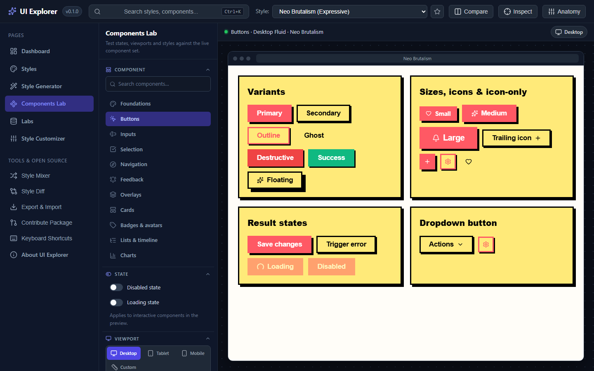
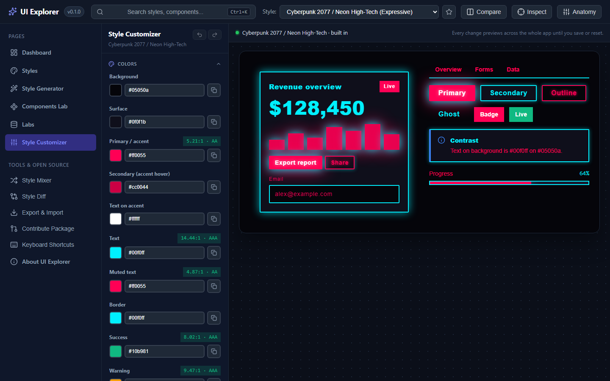
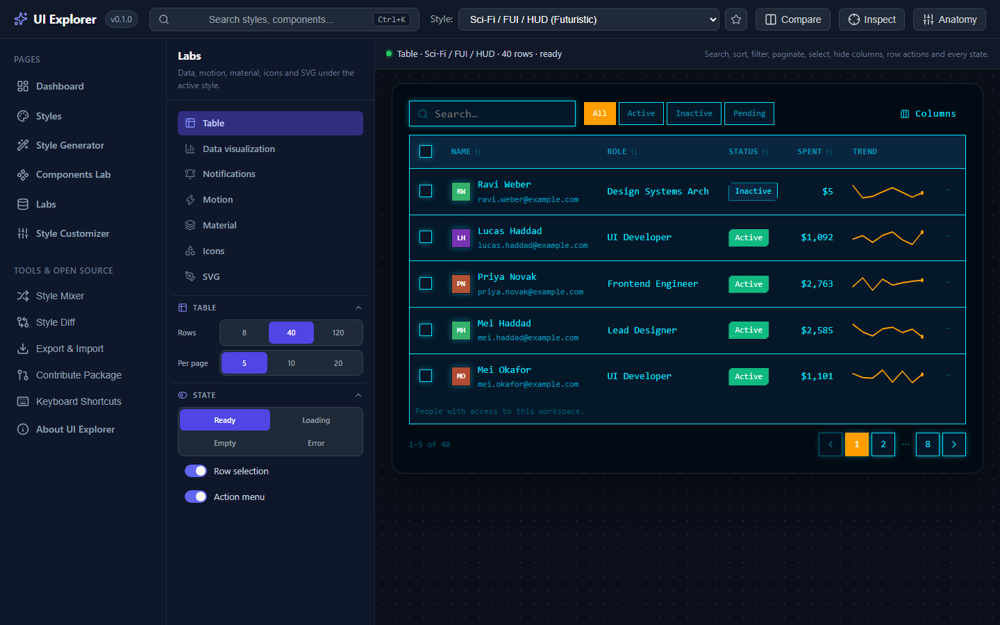

# UI Explorer

> An open-source laboratory for exploring, understanding and experimenting with interface design systems.

Thirty design styles — from Neumorphism to Neo Brutalism — each defined as a
complete token system rather than a palette swap, rendered through one real
component library. Switch a style and every button, card, table, chart,
overlay and icon changes construction. Generate new systems from a seed,
remix them, mix axes from different styles, tune every token by hand, inspect
why anything looks the way it does, and export the result.



## Features

### Styles

- 30 built-in styles across Morphism, Modern, Expressive, Futuristic, Retro and
  Minimalist, each with documentation (visual character, history, principles,
  best used for, avoid when) and related styles.
- A gallery with live thumbnails, search, category filters and discovery
  facets derived from the tokens themselves (material, mood, depth, motion,
  complexity), plus a relationship map showing declared relations,
  inheritance, remixes and duplicates.
- A detail drawer per style: docs, a completeness validator, similar styles by
  DNA, relations, and the package source with a link to the file on GitHub.

### Components & labs

- A full component library (buttons, inputs, selection, navigation, feedback,
  overlays, data display, tables, notifications) and SVG charts (line, area,
  bar, donut, radial, sparkline, scatter, waveform) that all read the active
  style.
- Components Lab with desktop / tablet / mobile / custom viewports, rulers,
  a responsive inspector and three-way style comparison.
- Labs for SVG backdrops, data visualisation, tables, notifications, motion,
  materials and icons.

### Generation

- Procedural engine 2.0: seed → personality → semantic recipe → compatibility
  weighting → repair → tokens. Coherent, Experimental and Extreme modes,
  per-axis locks, remix with strength, batch generation with near-duplicate
  rejection, a decision trace, Style DNA and a deterministic identity hash.
- Share links that reproduce a generated style exactly, including its remix
  lineage.

### Tools

- Style Customizer with a real colour picker and contrast readout, presets
  for every system, undo/redo, section resets and app-wide live preview.
- Style Anatomy, token inspector (click any element to see its tokens),
  style diff, side-by-side and triple compare with synced scrolling, and the
  Style Mixer for cross-style hybrids.
- Export as JSON tokens, CSS variables or a contribution package; import
  styles with validation; command palette (Ctrl+K) and keyboard shortcuts.

### Community

- Community styles are plain JSON packages under
  [`styles/community/`](styles/community/), indexed at build time, validated
  in CI and shown with author, licence and source. A package can `extends` a
  built-in style and override only what differs.
- A Python implementation of the engine for batch generation, validation and
  CI, verified bit-for-bit against the browser engine.

## Screenshots

| | |
| --- | --- |
|  |  |
|  |  |
|  |  |
|  |  |

**Live:** <https://chinto-lgtm.github.io/ui-explorer/> · **Docs:** <https://chinto-lgtm.github.io/ui-explorer/docs/> — both built from `main` by GitHub Actions.

## Getting started

Requires Node.js 20+ (Python 3.10+ for the engine tools).

```sh
npm install
npm run dev        # http://localhost:5173
```

```sh
npm test           # vitest: engine, registry, app
npm run lint       # oxlint
npm run build      # tsc + vite
```

Keyboard: `Ctrl+K` command palette · `Ctrl+E` customizer · `Ctrl+Shift+A`
anatomy · `Ctrl+Shift+C` compare · `Ctrl+Shift+D` diff · `Ctrl+Shift+X`
inspect · `?` all shortcuts.

## Deploying

The app is a static site with no backend. `npm run build` writes `dist/`,
which any static host serves as-is (Netlify, Vercel, Cloudflare Pages, S3…).
For hosts that serve under a sub-path, set `VITE_BASE_PATH=/sub-path/` at
build time; `.github/workflows/deploy.yml` does this for GitHub Pages and
copies `index.html` to `404.html` so deep links resolve.

## Project layout

```text
src/
  engine/         types, resolver, registry, context, validation, inheritance, share links
  engine/generator/  procedural engine: vocab, personalities, compatibility, colour, DNA
  styles/         30 built-in style definitions, treatments, docs, community loader
  components/     ui primitives, charts, svg, layout, preview
  features/       anatomy, compare, diff, inspector, mixer, export, search, shortcuts
  pages/          Welcome, Dashboard, Styles, Generator, Components Lab, Labs, Customizer
styles/community/ community style packages + index.json
schemas/          JSON schema for a style definition
tools/style-engine/  Python engine + validator (see its README)
docs/             guides and screenshots
```

## Creating and contributing styles

- [docs/creating-a-style.md](docs/creating-a-style.md) — generate, customise
  or hand-write a style; extend a built-in; validate.
- [CONTRIBUTING.md](CONTRIBUTING.md) — how to submit a package or code.
- [styles/community/README.md](styles/community/README.md) — the registry
  format.

The same pages are published as a documentation site (`npm run docs:dev`
locally; built by VitePress into `dist/docs`). Developer documentation:
[architecture](docs/architecture.md) ·
[style engine](docs/style-engine.md) · [style schema](docs/style-schema.md) ·
[procedural generation](docs/procedural-generation.md) ·
[community styles](docs/community-styles.md).

## Python engine

```sh
cd tools/style-engine
python -m style_engine generate --seed 847291
python -m style_engine inspect --seed 847291
python -m style_engine validate ../../styles/community/aurora-glass
```

The browser engine is the source of truth; the Python engine follows the same
algorithm and draw order and is checked against exported reference output by
`npm run engine:test`. Details in
[tools/style-engine/README.md](tools/style-engine/README.md).

## License

[MIT](LICENSE)
